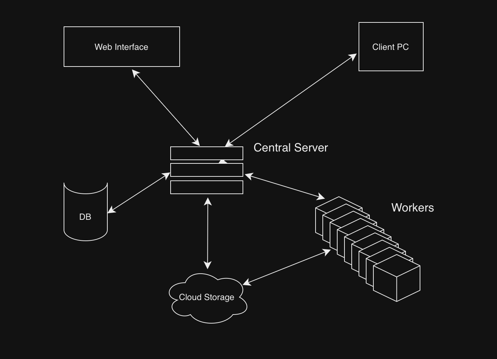

# METAMOTION

MetaMotion is a sophisticated implementation of management involved in the production of
larger animation projects, ranging from 2D vector or hand-drawn raster animation, to highly complex computer-rendered 3D animation. This suite provides the necessary tools
for successfully managing and planning months or years of projects.

# Features

* Issues - These are tasks assigned to a member on a team with a deadline. For example, one may be "Frames 45-210, due by next Monday".
* Rendering Planning - With larger computer-rendered animations, it may take months to render a couple of minutes. With a built-in calculator and testing software, one can efficently plan for this. It also manages distribution of powerful-rendering worker nodes.

# Motivation

Many software have been developed to accommendate workflows, like Pixar Tractor, Flameco, Jira, etc. but collectively have flaws. For example, our team may use different rendering engines depending on the art style of the project, but rendering nodes typically only support one kind of engine. Furthermore, our team desired a centralized management system, instead of fragmentation through multiple software they were unfamiliar with.

# Architecture

The architecture for this service consists of 5 microservices. One of these is the front-end web server. Another is the backend request. There is a database and a cloud storage. And lastly, there is a worker server, ran by a collections of computing machines optimized for rendering. 
The front-end is written in React for dynamic websites. The backend is was built with Django for scailability. These two services communicate mainly using REST. The backend communicates with DB through Django's built-in ORM.
